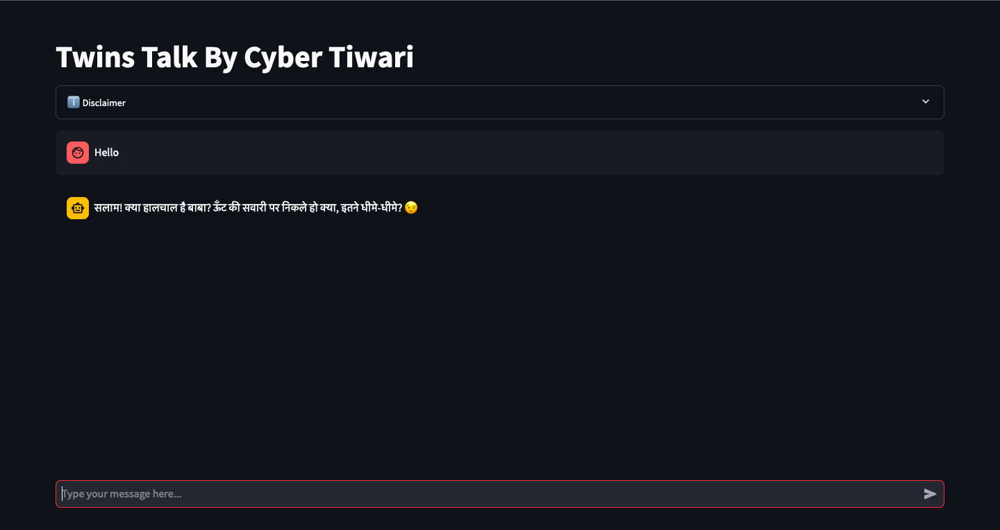

# Twins Talk



## Overview
Twins Talk is an open-source chatbot project built with Streamlit for seamless and engaging conversational AI experiences. The app is designed to provide interactive and customizable dialogues, supporting multilingual capabilities and a user-friendly interface.

## Features
- Real-time conversational AI built with Streamlit.
- Multilingual support for dynamic interactions.
- Fully customizable for personalized use cases.
- Lightweight and easy to deploy.

## Libraries and Dependencies
This project uses the following libraries:
- **Streamlit**: For building the interactive app.
- **OpenAI**: For AI-powered conversation handling.
- **python-dotenv**: For managing environment variables securely.

## Installation
To run this project locally, follow these steps:

1. **Clone the repository**:
   ```bash
   git clone https://github.com/cybertiwari/twinstalk.git
   ```

2. **Navigate to the project directory**:
   ```bash
   cd twinstalk
   ```

3. **Install the required dependencies**:
   ```bash
   pip install -r requirements.txt
   ```

4. **Copy the environment file**:
   ```bash
   cp .env.sample .env
   ```

5. **Replace the environment variables**:
   ```env
   API_KEY="open-ai-api-key"
   API_URL="https://api.openai.com/v1/chat/completions"
   LLM_MODEL_NAME="gpt-4o"
   SYSTEM_PROMPT="Your System Prompt"
   ```

6. **Run the app using Streamlit**:
   ```bash
   streamlit run app.py
   ```

7. **Open the project in your browser at the URL provided by Streamlit**: 
   ```
   (e.g. http://localhost:8501)
   ```

## Usage
- Run the app to start interacting with the chatbot.
- Use the intuitive interface to have conversations and explore the chatbot's capabilities.

## License
This project is licensed under the Creative Commons Attribution-NonCommercial 4.0 International (CC BY-NC 4.0) license. Usage is allowed for non-commercial purposes with proper credit to the author. See the [LICENSE](https://github.com/cybertiwari/twinstalk/blob/main/LICENSE) file for more details.

## Repository Link
[Twins Talk GitHub Repository](https://github.com/cybertiwari/twinstalk)